# Звіт лабораторної роботи №4

## Частина 1: Базова агрегація

### Запит 1.1: Використовує COUNT(DISTINCT member_id) для підрахунку загальної кількості унікальних читачів у таблиці Member.

```sql
SELECT COUNT(DISTINCT member_id) AS total_members
FROM Member;
```

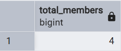

### Запит 1.2: Використовує COUNT(\*) для підрахунку загальної кількості всіх видач книг (операцій позики), зафіксованих у таблиці Loan.

```sql
SELECT COUNT(*) AS total_loans
FROM Loan;
```

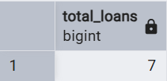

### Запит 1.3: Використовує SUM() та WHERE для обчислення загальної суми всіх штрафів, які мають статус 'Нараховано' (не сплачені).

```sql
SELECT SUM(amount) AS total_fines_charged
FROM Fine
WHERE status = 'Нараховано';
```

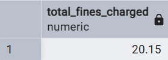

### Запит 1.4: Використовує AVG() та WHERE для розрахунку середньої суми штрафу, який вже був 'Сплачено'.

```sql
SELECT ROUND(AVG(amount), 2) AS average_paid_fine
FROM Fine
WHERE status = 'Сплачено';
```

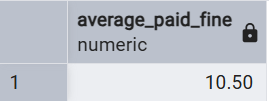

### Запит 1.5: Використовує MIN(registration_date) для знаходження найпершої дати реєстрації читача (найстарішого читача) у системі.

```sql
SELECT
MIN(registration_date) AS earliest_registration
FROM Member;
```

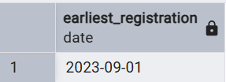

### Запит 1.6: Використовує MAX(amount) для знаходження найбільшої суми, яка була нарахована як штраф за одну позику.

```sql
SELECT
MAX(amount) AS highest_fine
FROM Fine;
```

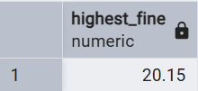

## Частина 2: Групування даних (GROUP BY)

### Запит 2.1: Використовує GROUP BY department та COUNT(librarian_id) для групування бібліотекарів за їхніми відділами (department) та підрахунку кількості працівників у кожному відділі.

```sql
SELECT department, COUNT(librarian_id) AS num_librarians
FROM Librarian
GROUP BY department;
```

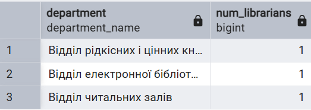

### Запит 2.2: Використовує GROUP BY category_id для групування книг за їхніми категоріями та підрахунку кількості книг, що належать до кожної категорії. Результат впорядковано (ORDER BY) за зменшенням кількості книг.

```sql
SELECT category_id, COUNT(book_id) AS num_books
FROM BookCategory
GROUP BY category_id
ORDER BY num_books DESC;
```

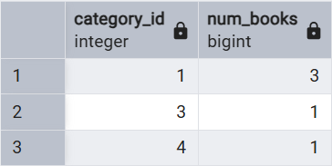

### Запит 2.3: Використовує GROUP BY status та COUNT(\*) для групування всіх операцій видачі книг (Loan) за їхнім статусом ('Видано', 'Повернено', 'Прострочено') та підрахунку загальної кількості операцій для кожного статусу.

```sql
SELECT status, COUNT(*) AS loan_count
FROM Loan
GROUP BY status;
```

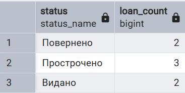

## Частина 3: Фільтрування груп (HAVING)

### Запит 3.1: Використовує GROUP BY для групування видач за читачем та HAVING COUNT(\*) > 1 для фільтрації, залишаючи лише тих читачів, хто взяв більше однієї книги.

```sql
SELECT member_id, COUNT(*) AS books_taken_count
FROM Loan
GROUP BY member_id
HAVING COUNT(*) > 1;
```

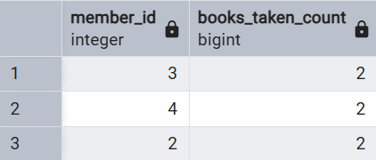

### Запит 3.2: Фільтрує видачі за статусом 'Прострочено' (WHERE), групує їх за книгою (GROUP BY) та знаходить ті книги, які прострочені у двох або більше читачів (HAVING COUNT(\*) >= 2).

```sql
SELECT book_id, COUNT(*) AS overdue_count
FROM Loan
WHERE status = 'Прострочено'
GROUP BY book_id
HAVING COUNT(*) >= 2;
```

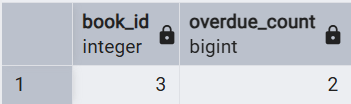

## Частина 4: Запити JOIN

### Запит 4.1 (INNER JOIN): Об'єднує таблиці Member, Loan та Book для відображення списку "Хто що брав". Включає лише читачів, які мають видачі.

```sql
SELECT m.name AS member_name, m.surname AS member_surname, b.title AS book_title
FROM Member m
INNER JOIN Loan l ON m.member_id = l.member_id
INNER JOIN Book b ON l.book_id = b.book_id;
```

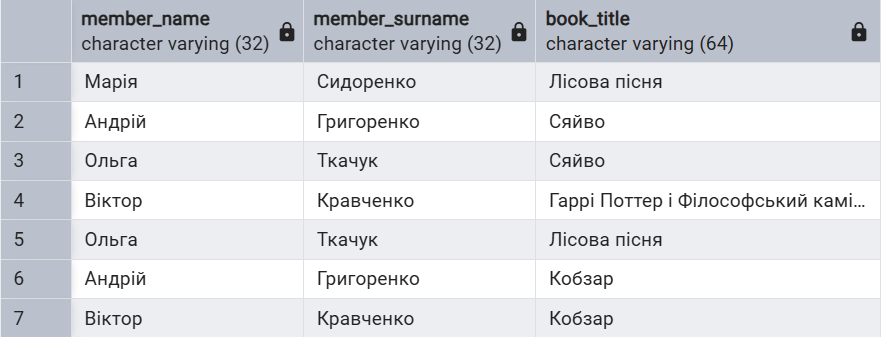

### Запит 4.2 (LEFT JOIN): Об'єднує Author, AuthorBook та Book. Цей запит показує всіх авторів, навіть якщо у них немає книг у базі (у такому випадку поле title буде NULL).

```sql
SELECT a.name, a.surname, b.title
FROM Author a
LEFT JOIN AuthorBook ab ON a.author_id = ab.author_id
LEFT JOIN Book b ON ab.book_id = b.book_id;
```

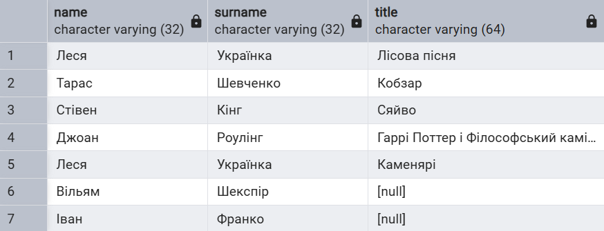

### Запит 4.3 (RIGHT JOIN): Об'єднує AuthorBook, Author та Book. Цей запит показує всі книги, навіть якщо вони не мають автора (поле name буде NULL).

```sql
SELECT b.title, a.name, a.surname
FROM AuthorBook ab
JOIN Author a ON ab.author_id = a.author_id
RIGHT JOIN Book b ON ab.book_id = b.book_id;
```

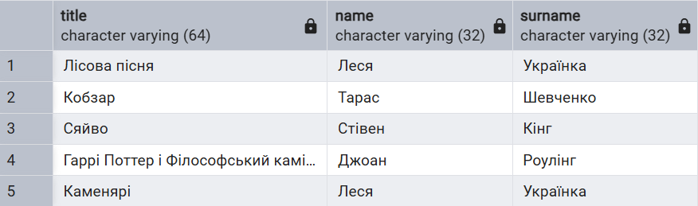

### Запит 4.4 (CROSS JOIN): Створює декартовий добуток таблиць Member та Category. Результат – кожна можлива пара "читач-категорія".

```sql
SELECT m.name AS member_name, c.category_name
FROM Member m
CROSS JOIN Category c;
```

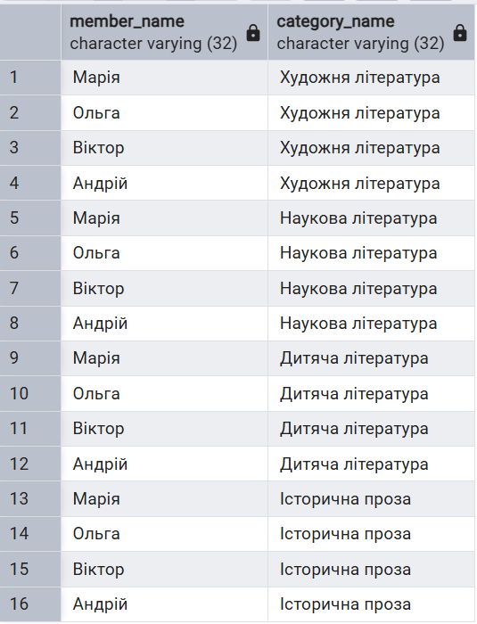

## Частина 5: Багатотаблична агрегація

### Запит 5.1: Групує результати за читачем та підсумовує (SUM) загальну суму нарахованих штрафів для кожного.

```sql
SELECT m.name, m.surname, SUM(f.amount) AS total_fines_due
FROM Member m
JOIN Loan l ON m.member_id = l.member_id
JOIN Fine f ON l.loan_id = f.loan_id
WHERE f.status = 'Нараховано'
GROUP BY m.member_id, m.name, m.surname
ORDER BY total_fines_due DESC;
```

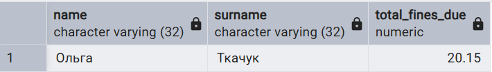

### Запит 5.2: Об'єднує Category, BookCategory, Book та Loan. Групує за назвою категорії та підраховує (COUNT), скільки разів книги з цієї категорії були видані.

```sql
SELECT c.category_name, COUNT(l.loan_id) AS times_loaned
FROM Category c
JOIN BookCategory bc ON c.category_id = bc.category_id
JOIN Book b ON bc.book_id = b.book_id
JOIN Loan l ON b.book_id = l.book_id
GROUP BY c.category_id, c.category_name
ORDER BY times_loaned DESC;
```

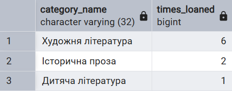

## Частина 6: Підзапити

### Запит 6.1 (Підзапит у WHERE): Знаходить book_id для "Лісова пісня" у внутрішньому запиті, потім member_id, які брали цю книгу, у середньому, і, нарешті, імена цих читачів у зовнішньому запиті.

```sql
SELECT name, surname
FROM Member
WHERE member_id IN (
    SELECT member_id
    FROM Loan
    WHERE book_id = (
        SELECT book_id
        FROM Book
        WHERE title = 'Лісова пісня'
    )
);
```

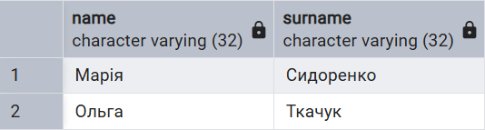

### Запит 6.2 (Корельований підзапит у SELECT): Для кожного читача із зовнішнього запиту (Member m) виконує внутрішній запит, який рахує (COUNT) кількість його видач (Loan l) за умовою l.member_id = m.member_id.

```sql
SELECT
    m.name,
    m.surname,
    (SELECT COUNT(*) FROM Loan l WHERE l.member_id = m.member_id) AS total_loans
FROM
Member m;
```

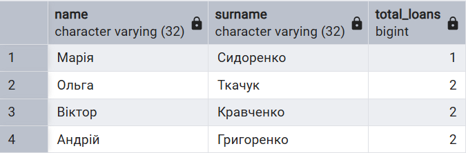

### Запит 6.3 (Підзапит у FROM): Внутрішній запит (librarian_stats) спочатку створює тимчасову таблицю з кількістю видач для кожного бібліотекаря. Потім зовнішній запит обчислює середнє (AVG) значення з цієї тимчасової таблиці.

```sql
SELECT ROUND(AVG(books_issued), 2) AS avg_loans_per_librarian
FROM (
    SELECT librarian_id, COUNT(*) AS books_issued
    FROM Loan
    GROUP BY librarian_id
) AS librarian_stats;
```

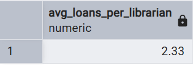
