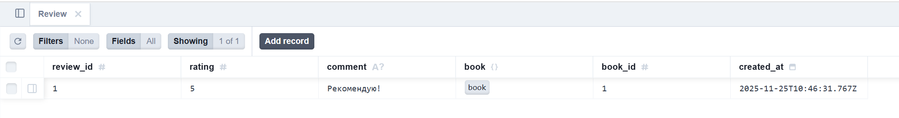
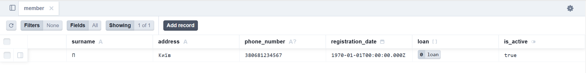
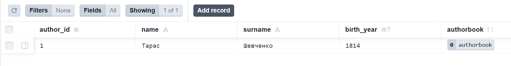

# Звіт Prisma (Лабораторна 6)

## 1. Міграція: `add-review-table`

**Опис:** Додано нову модель `Review` для відгуків про книги та створено зв'язок "один-до-багатьох" з моделлю `book`.

**Зміни в `schema.prisma` (Фрагмент `Review`):**

```prisma
// Після
model Review {
  review_id Int    @id @default(autoincrement())
  rating    Int
  comment   String? @db.VarChar(512)
  book      book   @relation(fields: [book_id], references: [book_id])
  book_id   Int
  created_at DateTime @default(now()) @db.Timestamp(3)

  @@index([book_id])
}

// У моделі book додано:
   reviews Review[]
```

**Згенерований `migration.sql`:**

```sql
-- CreateTable
CREATE TABLE "Review" (
    "review_id" SERIAL NOT NULL,
    "rating" INTEGER NOT NULL,
    "comment" VARCHAR(512),
    "book_id" INTEGER NOT NULL,
    "created_at" TIMESTAMP(3) NOT NULL DEFAULT CURRENT_TIMESTAMP,

    CONSTRAINT "Review_pkey" PRIMARY KEY ("review_id")
);

-- AddForeignKey
ALTER TABLE "Review" ADD CONSTRAINT "Review_book_id_fkey" FOREIGN KEY ("book_id") REFERENCES "book"("book_id") ON DELETE RESTRICT ON UPDATE CASCADE;
```

## 2. Міграція: `add-is-active-to-member`

**Опис:** Додано поле `is_active` (логічний прапорець) зі значенням за замовчуванням `TRUE` до моделі `member`.

**Зміни в `schema.prisma` (Фрагмент `member`):**

```prisma
model member {
  member_id         Int      @id @default(autoincrement())
  name              String   @db.VarChar(32)
  surname           String   @db.VarChar(32)
  address           String
  phone_number      String?  @unique @db.VarChar(13)
  registration_date DateTime @db.Date
  loan              loan[]
  is_active         Boolean  @default(true)  // 5. Додано поле в моделі
}
```

**Згенерований `migration.sql`:**

```sql
-- AlterTable
ALTER TABLE "member" ADD COLUMN     "is_active" BOOLEAN NOT NULL DEFAULT true;
```

## 3. Міграція: `deop-author-country-field`

**Опис:** Видален свтопець `country` з моделі `author`.

**Зміни в `schema.prisma` (Фрагмент `author`):**

```prisma
model author {
  author_id  Int          @id @default(autoincrement())
  name       String       @db.VarChar(32)
  surname    String       @db.VarChar(32)
  birth_year Int?         @db.SmallInt
  // 6. Видалено стовпець country
  authorbook authorbook[]
}
```

**Згенерований `migration.sql`:**

```sql
-- AlterTable
ALTER TABLE "author" DROP COLUMN "country";
```

## 4. Перевірка результатів за допомогою Prisma Studio

### Команда запуску Studio:

```
npx dotenv -e ./.env -- npx prisma studio
```

## Докази коректності схеми та запитів:

## 1. Перевірка таблиці `Review` та зв'язку

У Prisma Studio успішно створено новий запис у таблиці `Review`, що підтверджує, що міграція `add-review-table `була успішною і зовнішній ключ `book_id` працює.



## 2. Перевірка зміни таблиці `Member`

У таблиці member перевірено наявність нового стовпця `is_active` та його значення за замовчуванням.



## 3. Перевірка видалення стовпця `country`

Перевірка моедлі `author`: стовпець `country` відсутній, що підтвердує успішність міграції `drop-authir-country-field`.


